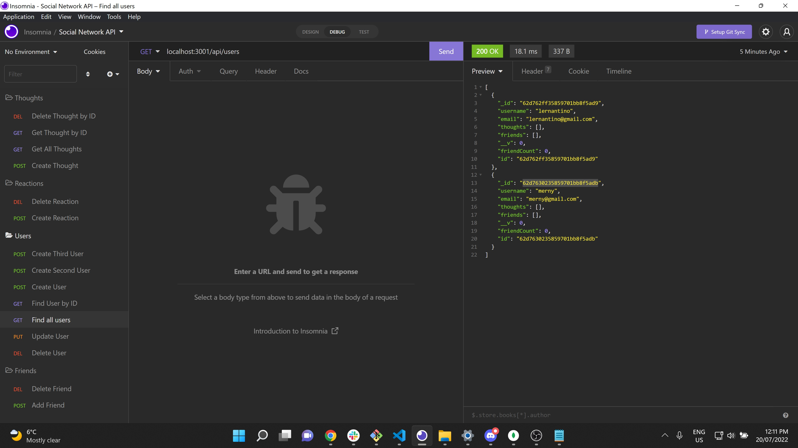

# social-network-API

## Description

An API for use by a social media front end that has functionality for users, thoughts and reactions.

### Functionality

Through Insomnia its possible to test and use the API to add, update and remove users, find a specific user, add and remove friends, create thoughts, get all thoughts, get a specific thought, remove a specific thought and finally add and remove friends.

### Installation & Usage Instructions

Clone the github to your local machine, open your terminal, npm install, npm start.

### Technologies Used

MongoDB, Insomnia, Javascript, express, mongoose.

### Directions for Future Development

Add extra functionality such as find specific friend, update thoughts and reactions.

## Screenshot

## Links

[Installing API through VSC](https://drive.google.com/file/d/1OaUV9eq9fY_p2ZqofB466OHQzkQilRYM/view?usp=sharing)

[Insomnia Demonstration](https://drive.google.com/file/d/1C7ZEtIAmRnHckk378r3unrrHXaPvQXRZ/view?usp=sharing)